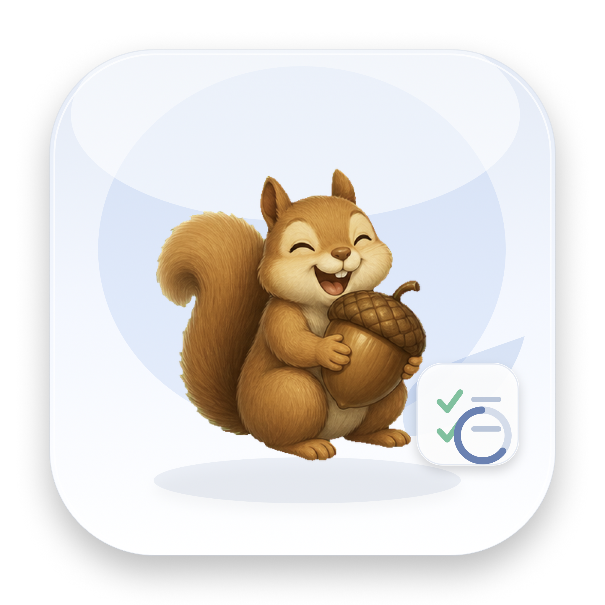

<p align="center">
  
</p>

# DayDayUp

DayDayUp 是一款 macOS 原生学习执行监督工具，帮你把已经决定要学的内容变成每天能推进、能提醒、能复盘的任务系统。

它不是学习路线生成器，也不是普通待办清单。DayDayUp 更像一个学习执行台：你自己决定学什么，它负责盯住 deadline、记录执行过程、暴露拖延风险，并在任务完成后留下可回看的学习轨迹。

> 写下任务，看见下一步，按时闭环。

## 适合谁

- 正在自学 AI Agent、RAG、大模型应用开发、Swift、工程化或其他长期技能的人。
- 已经有学习路线、课程、GitHub 项目或论文清单，但容易拖延的人。
- 希望知道“今天最该推进哪一项”，而不是每天重新整理计划的人。
- 想复盘自己是否真的按时完成、是否经常补完成、在哪些方向投入最多时间的人。

## 它解决什么问题

长期学习的问题通常不是“不知道要学什么”，而是任务写下来以后没有持续执行压力：

- deadline 快到了才想起来。
- 每天打开电脑，不知道先做哪一个任务。
- 学习记录散落在笔记、浏览器、GitHub 和脑子里。
- 完成、逾期、补完成混在一起，复盘时看不清真实节奏。
- 明明学了很多，却没有一个稳定的执行力指标。

DayDayUp 把这些事情集中到一个原生 macOS 应用里：任务、倒计时、提醒、专注记录、完成状态、学习历程和执行力评分都围绕同一组学习任务展开。

## 基本工作流

1. 创建学习任务：写下任务名称、学习方向、任务内容、完成标准、资料链接和 deadline。
2. 打开启动页：直接看到当前最紧急的未完成任务和下一截止任务。
3. 进入今日执行：开始专注计时，推进任务进度，记录卡住原因或学习备注。
4. 到点提醒：截止前提醒，逾期后继续记录 App 内提醒和未按时完成事件。
5. 完成或补完成：区分按时完成、提前完成、逾期未完成和逾期后补完成。
6. 复盘数据：通过执行力评分、任务日历、学习历程和方向投入看清长期节奏。

## 核心特性

### 任务执行监督

每个任务都围绕“能不能按时闭环”设计，而不是只做一个勾选项。

- 任务名称、学习方向、任务内容、完成标准、资料链接和备注。
- 秒级 deadline，支持快捷设置 5 分钟后、30 分钟后、今晚和明晚。
- 任务进度、预计学习时长、开始时间、完成时间和延期时长。
- 卡住原因、补救记录和复盘备注。

### 启动倒计时

打开应用后首先看到当前最该处理的任务。

- 最近未完成任务优先展示。
- 已逾期任务会进入红色风险状态。
- 如果当前任务不是下一截止任务，会额外提示“下一截止”。
- 小松鼠状态图会随任务状态变化，提供轻量反馈。

### 今日执行

今日页用于实际推进任务，不是再做一份计划。

- 待完成任务列表。
- 今日专注时长。
- 逾期未完成数量。
- 任务进度快速更新。
- 对指定任务开始、暂停和结束专注计时。

### Deadline 和提醒

DayDayUp 同时处理系统通知和 App 内提醒。

- 截止前提醒。
- 逾期后提醒。
- 系统通知被拒绝或状态未知时，仍保留 App 内提醒和事件记录。
- 每个提醒事件只插入一次，避免重复刷屏。
- 任务已经完成后自动取消待发送提醒。

### 四种任务状态

DayDayUp 不把所有完成都混成一种结果，而是区分执行质量：

| 状态 | 含义 | 颜色 |
| --- | --- | --- |
| 按时或提前完成 | 在 deadline 前闭环 | 绿色 |
| 进行中 | 未完成且尚未逾期 | 默认色 |
| 逾期未完成 | deadline 已过但任务仍未闭环 | 红色 |
| 逾期后补完成 | 曾经逾期，后来补上 | 紫色 |

这些状态会同步影响任务列表、启动页、日历、学习历程和执行力评分。

### 数据评分和任务日历

数据看板用于复盘学习节奏，而不是制造复杂报表。

- 执行力评分。
- 任务完成率、准时率、提前率、补完成率和闭环率。
- 今日和本周专注时长。
- 各学习方向投入时间。
- 任务日历：用颜色表达按时完成、逾期未完成和逾期后补完成。
- 雷达图：展示任务完成度、准时完成率、提前完成率、延迟控制、专注稳定度和复盘完整度。

### 学习历程

每个任务都有自己的时间线，用来回答“这个任务到底是怎么推进的”。

- 制定计划。
- 开始执行。
- 截止时间。
- 未按时完成。
- 截止前提醒和逾期提醒。
- 进度更新。
- 卡住原因。
- 补完成。
- 完成任务。
- 复盘记录。

这样复盘时能看到真实过程，而不是只看到一个最终完成状态。

### macOS 原生体验

- SwiftUI 原生界面。
- SwiftData 本地存储。
- UserNotifications 系统提醒。
- MenuBarExtra 菜单栏倒计时。
- WidgetKit 小组件。
- JSON 备份导出、预览和导入合并。
- 浅色和深色外观下使用不同 App 图标资源。

## 产品边界

DayDayUp 暂时不做这些事：

- 不自动生成学习路线。
- 不自动拆解 GitHub Roadmap。
- 不做社交打卡、排行榜或群组监督。
- 不做复杂项目管理，比如甘特图、多人协作和权限管理。
- 不做重度游戏化，比如大量积分、等级和强打扰动画。

## 技术栈

- SwiftUI
- SwiftData
- UserNotifications
- WidgetKit
- AppIntents
- Swift Testing
- macOS 原生菜单栏和窗口体验

## 运行环境

- macOS
- Xcode 17 或更新版本
- macOS 26 SDK

如果系统默认 `xcode-select` 指向 Command Line Tools，可以临时指定 Xcode：

```sh
DEVELOPER_DIR=/Applications/Xcode.app/Contents/Developer xcodebuild -list -project DayDayUp.xcodeproj
```

## 本地运行

1. 用 Xcode 打开 `DayDayUp.xcodeproj`。
2. 选择 `DayDayUp` scheme。
3. 选择 `My Mac` 作为运行目标。
4. Build and Run。

命令行构建：

```sh
DEVELOPER_DIR=/Applications/Xcode.app/Contents/Developer \
  xcodebuild build \
  -project DayDayUp.xcodeproj \
  -scheme DayDayUp \
  -destination 'platform=macOS'
```

## 测试

```sh
DEVELOPER_DIR=/Applications/Xcode.app/Contents/Developer \
  xcodebuild test \
  -project DayDayUp.xcodeproj \
  -scheme DayDayUp \
  -destination 'platform=macOS'
```

当前测试覆盖任务状态、deadline 修正、逾期事件、提醒策略、通知授权状态、评分指标、任务日历、学习历程排序、备份恢复和 Widget 快照规则。

## 项目结构

- `DayDayUp/App`：应用入口与全局启动配置。
- `DayDayUp/Models`：SwiftData 模型、任务状态、deadline 和事件定义。
- `DayDayUp/Rules`：评分、日历、里程碑、逾期事件和提醒运行时策略。
- `DayDayUp/Services`：提醒调度、Widget 快照、备份导入导出。
- `DayDayUp/Design`：颜色、玻璃效果、小松鼠状态图和通用样式。
- `DayDayUp/Views`：启动倒计时、今日执行、任务管理、评分、历程、设置和共享组件。
- `DayDayUpWidgetsExtension`：macOS Widget 扩展。
- `DayDayUpTests`：核心规则和数据流测试。
