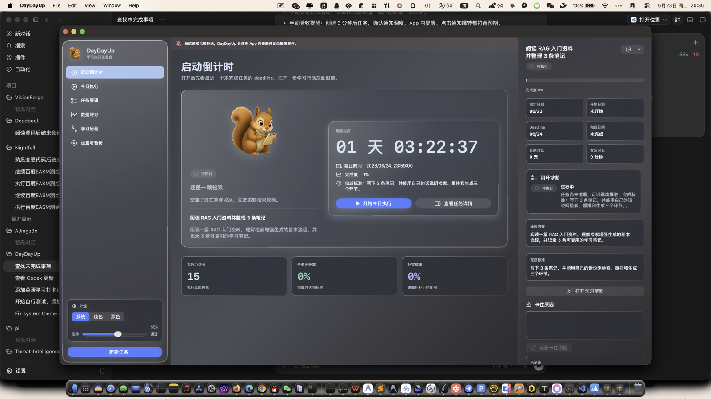
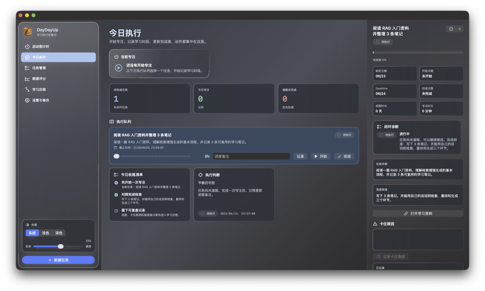
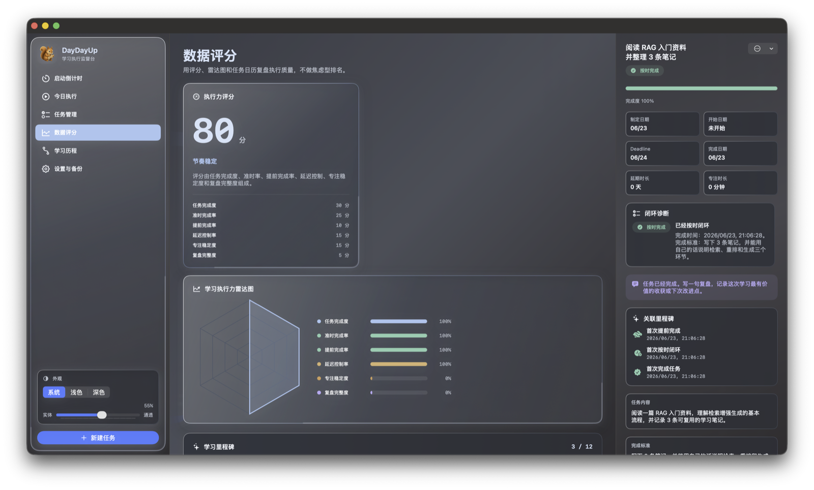

<p align="center">
  <picture>
    <source media="(prefers-color-scheme: dark)" srcset="DayDayUp/Assets.xcassets/AppLogo.imageset/DayDayUpAppIconDark.png">
    
  </picture>
</p>

<h1 align="center">DayDayUp</h1>

<p align="center">
  面向个人长期学习的 macOS 原生执行监督台，把学习任务变成可倒计时、可提醒、可闭环、可复盘的日常系统
</p>

<p align="center">
  
  
  
  
  
</p>

---

## 项目介绍

**DayDayUp** 是一款给自学者使用的学习执行监督工具。

它解决的不是“我要学什么”，而是“我已经决定要学了，怎么每天真的推进下去”。你把课程、论文、GitHub 项目、AI Agent / RAG / 大模型应用开发等学习任务录入进去，DayDayUp 会围绕每个任务的 deadline 做倒计时、提醒、状态判断、专注记录和复盘归档。

**适用场景**：长期自学、技术路线推进、项目制学习、考试备考、论文阅读、开源项目拆解、任何需要按 deadline 持续闭环的个人学习计划。

---

## 界面预览

| 启动倒计时 | 今日执行 | 数据评分 |
| --- | --- | --- |
|  |  |  |

---

## 第一次打开怎么用

1. 点击 **创建第一个学习任务**，填入学习方向、任务内容、完成标准、资料链接、deadline 和预计时长。
2. 不确定怎么填时，点击 **用示例任务体验**。示例只会在你主动点击后创建，不会自动写入正式学习记录。
3. 回到启动页查看最近 deadline，在今日执行里开始专注、更新进度，完成后写一句复盘。

---

## 特性概览

- 打开应用即显示当前最该处理的学习任务，减少每天重新整理计划的成本
- 空数据时提供首次引导和示例任务入口，新用户能直接理解记录一条学习任务需要哪些信息
- 每个任务都有 deadline、完成标准、进度、资料链接、卡住原因、补救记录和复盘备注
- 支持秒级 deadline 和快捷时间设置，适合测试提醒、短任务和精确截止场景
- 同时支持系统通知和 App 内提醒，点击通知会回到对应任务，通知权限不可用时仍会记录提醒事件
- 区分按时完成、进行中、逾期未完成、逾期后补完成，不把所有完成混成一个结果
- 内置专注计时，学习时长直接归属到具体任务
- 数据看板提供执行力评分、闭环率、准时率、提前率、补完成率和任务日历
- 学习历程按任务记录计划、开始、截止、提醒、逾期、补完成、完成和复盘事件
- 菜单栏显示当前任务倒计时，macOS Widget 输出今日任务和节奏快照
- 本地 SwiftData 存储，支持 JSON 备份导出、预览和导入合并

---

## 它和普通待办有什么不同

普通待办关心“有没有勾掉”，DayDayUp 关心“有没有按时闭环”。

| 能力 | 普通待办 | DayDayUp |
| --- | --- | --- |
| 任务内容 | 记录事项 | 记录学习方向、内容、标准、资料和备注 |
| 时间压力 | 通常只有日期 | deadline 倒计时、截止前提醒、逾期提醒 |
| 执行过程 | 结果为主 | 记录开始、进度、专注、卡住原因和补救 |
| 完成质量 | 完成 / 未完成 | 按时、提前、逾期未完成、逾期后补完成 |
| 复盘数据 | 较弱 | 执行力评分、任务日历、学习历程和方向投入 |

---

## 使用流程

```text
创建学习任务
  ↓
设置 deadline 和完成标准
  ↓
启动页查看最紧急任务
  ↓
今日执行里开始专注和更新进度
  ↓
系统通知或 App 内提醒触发
  ↓
按时完成 / 逾期补完成 / 记录卡住原因
  ↓
通过评分、日历和学习历程复盘执行节奏
```

---

## 任务状态

DayDayUp 用任务状态表达执行质量，并在启动页、任务列表、日历、历程和评分中保持一致。

| 状态 | 含义 | 视觉语义 |
| --- | --- | --- |
| 按时或提前完成 | 在 deadline 前完成并闭环 | 绿色，表示节奏健康 |
| 进行中 | 任务尚未完成，但还没有逾期 | 默认色，表示继续推进 |
| 逾期未完成 | deadline 已过，任务仍未闭环 | 红色，表示需要优先处理 |
| 逾期后补完成 | 曾经逾期，后来补上 | 紫色，表示风险已补救但仍计入复盘 |

---

## 主要界面

- **启动倒计时**：显示最近未完成任务、下一截止任务、任务状态和小松鼠反馈。
- **今日执行**：聚合待完成任务、今日专注时长、逾期数量和任务进度操作。
- **任务管理**：创建、筛选、搜索、编辑任务，并查看任务详情。
- **数据评分**：查看执行力评分、雷达图、方向投入、任务日历和关键指标。
- **学习历程**：按任务归档每一次计划、提醒、逾期、补救、完成和复盘。
- **设置与备份**：管理通知、Widget、外观、JSON 备份导入导出和诊断信息。

---

## 技术实现

- **SwiftUI**：构建 macOS 原生界面、菜单栏和多页面工作台。
- **SwiftData**：本地存储任务、学习时段、事件、设置和里程碑。
- **UserNotifications**：调度截止前提醒和逾期提醒。
- **WidgetKit**：输出今日任务、节奏风险和看板快照。
- **AppIntents**：支持 Widget 与主 App 的任务入口联动。
- **Swift Testing**：覆盖任务状态、deadline、提醒、日历、评分、备份和 Widget 规则。

---

## 本地启动

环境要求：

- macOS
- Xcode 17 或更新版本
- macOS 26 SDK

用 Xcode 打开项目：

```bash
open DayDayUp.xcodeproj
```

选择 `DayDayUp` scheme，运行目标选择 `My Mac`，然后 Build and Run。

如果命令行默认 `xcode-select` 指向 Command Line Tools，可以临时指定 Xcode：

```bash
DEVELOPER_DIR=/Applications/Xcode.app/Contents/Developer \
  xcodebuild build \
  -project DayDayUp.xcodeproj \
  -scheme DayDayUp \
  -destination 'platform=macOS'
```

运行测试：

```bash
DEVELOPER_DIR=/Applications/Xcode.app/Contents/Developer \
  xcodebuild test \
  -project DayDayUp.xcodeproj \
  -scheme DayDayUp \
  -destination 'platform=macOS'
```

---

## 项目结构

```text
DayDayUp/
├── App/                 应用入口与全局启动配置
├── Application/         任务命令、专注状态机、提醒、成就与 Widget 协调
├── Design/              颜色、玻璃效果、小松鼠状态图和通用样式
├── Models/              SwiftData 模型、任务状态、deadline 和事件定义
├── Persistence/         版本化 Schema、关系回填、单例与数据完整性修复
├── Rules/               评分、日历、里程碑、逾期事件和提醒策略
├── Services/            提醒调度、Widget 快照、备份导入导出
├── Shared/              App 与 Widget 共用的数据结构
└── Views/               启动、今日、任务、评分、历程、设置和共享组件

DayDayUpWidgetsExtension/  macOS Widget 扩展
DayDayUpTests/             核心规则和数据流测试
```

---

## 产品边界

DayDayUp 只做个人学习执行监督，暂时不做：

- 自动生成学习路线
- 自动拆解 GitHub Roadmap
- 社交打卡、排行榜或群组监督
- 甘特图、多人协作、权限管理等复杂项目管理能力
- 积分、等级、大量徽章等重度游戏化系统
